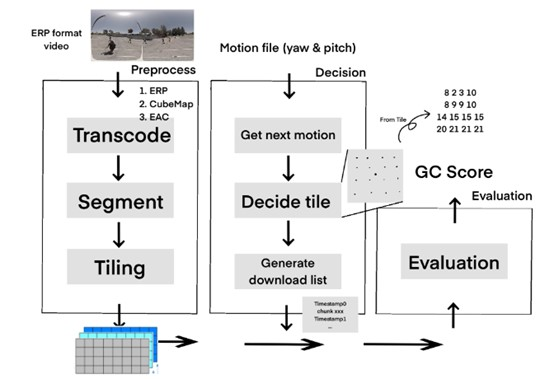
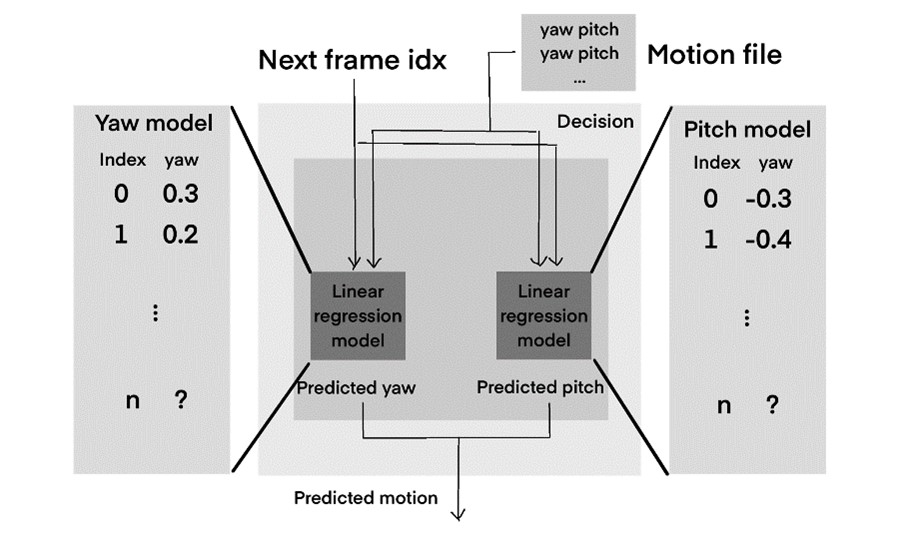
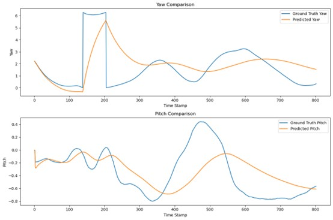
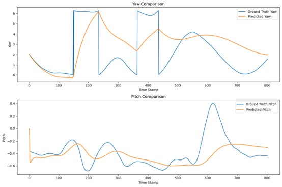
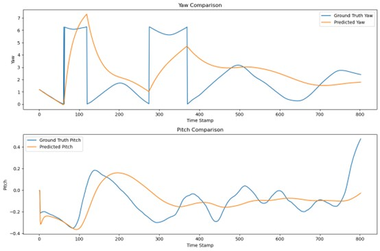
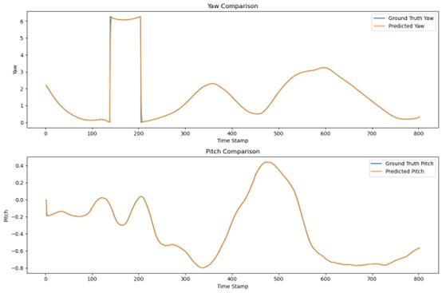
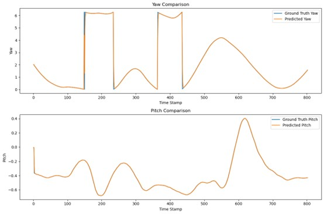
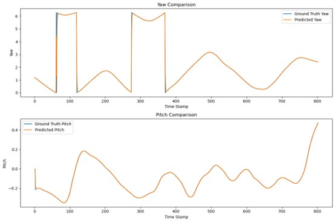
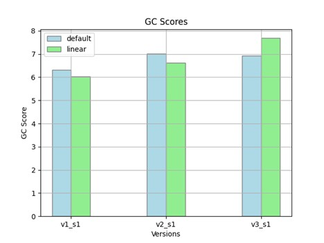

# The name of the open-source project 
E3PO

# The problem in the original project

## 1. Baseline ERP method explanation
First, we will briefly explain the baseline ERP methodology, including its system architecture and the downsides it has.

### 1.1 System architecture
The provided framework works as a basic 360 video streaming system, it is composed of three modules: preprocessing, streaming-related decision-making, and (score) evaluation. The preprocessing utilizes ERP projection to transcode the video, segment it, and generate tiles. The decision part downloads the required video tile according to the current user FOV, or we can say motion. By examining the tiles and the motion file, a score evaluation can then be done by the evaluation module.

360 video streaming can be realized by this basic system. However, it has several downsides, which will be explained in the following paragraph.

### 1.2	Downsides
Although the baseline ERP method approach is effective for the transmission of 360-degree videos, it has several downsides. First, this kind of projection projects the spherical image while keeping the uniformity of the polar and the azimuth angle. This property brings about the non-uniformity of pixel distribution. The video tiles will have lower resolution due to it, influencing user experience. Additionally, the discontinuity and the non-uniformity result in challenges if we want to apply image processing algorithms. Second, the video tiles are downloaded according to the current user FOV. The processing and transmission time it requires leads to the high latency of high-quality stream content delivery.
Considering these drawbacks, we found that we can either work on enhancing the projection method to solve the former problem or add a motion prediction module into the system to solve the latter problem. Since adopting a new projection method is mathematically and implement-wise challenging, we decided to go for motion prediction.

# Detailed description of the proposed solution

## 2.	Our approach

### 2.1	Existing motion prediction methods
Before our implementation, we first surveyed about current existing motion prediction methodologies. There are mainly three categories: machine learning-based methods, computer vision-based methods, and pure mathematical methods. We will explain their advantages and drawbacks one by one. 

#### 2.1.1	Machine learning-based methods
For machine learning-based methods, there are two most popular ones. The first one is the LSTM (Long Short-Term Memory) model, a type of artificial neural network (RNN) architecture specifically designed to address a challenge faced by traditional RNNs: the vanishing gradient problem. This can be utilized to train a motion prediction model, and the pre-trained model can then be merged into the system for real-time motion prediction. The second one is the attention model. It’s a novel machine-learning technique, and it deals with sequential data like text or time series, which is an idea for motion prediction (the motion file is a sequence of yaw and pitch angles). 
Nonetheless, considering the challenges we must face to implement them, we decided not to adopt this kind of method.

#### 2.1.2	Computer vision-based methods
The computer vision-based methods, mainly utilize key frame extraction to identify the main moving object. This enables efficient motion predictions. However, similarly, we decided not to adopt these methods due to difficulty considerations.

#### 2.1.3	Mathematical methods
Lastly, there are mathematical methods, like exponential smoothing, and linear regression. The former predicts motions by sliding windows, and the latter produces a linear function, that can fit the motion of the user.
Considering the simplicity of this method and how straightforward it is, we decided to implement it firsthand.

### 2.2	Our proposed method
We leveraged the linear progression idea and implemented a linear regression model. The model takes the next frame index and the motion file containing yaw and pitch angles as input. After the input is processed by two regression models for the two angles respectively, we can get the predicted motion by combining the predicted yaw angle and predicted pitch angle. 

## 3.	Experiments

### 3.1	Experimental setup
We take the three videos (v1_s1, v2_s1, v3_s1) as the dataset, after adopting different motion prediction methods, we will evaluate and compare the results according to the GC score gained by them.

### 3.2	Result produced by our method

#### 3.2.1	v1_s1

#### 3.2.2	v2_s1

#### 3.2.3	v3_s1

The predictions made by our method don’t fit the curve, but they fit the trend (slope) of the curve, producing a smooth curve.

### 3.3 The result produced by exponential smoothing method

#### 3.2.1	v1_s1

#### 3.2.2	v2_s1

#### 3.2.3	v3_s1

As you can see, the exponential smoothing method predicts the motion precisely.

### 3.4	Observations about the GC score
Despite of fact that our motion prediction is way less accurate than the default exponential smoothing method, the GC Score only drops a bit from that in the first two videos and even gets higher in the third one. From the table, we know that although we would get a 1~2 higher average MSE, we achieve a lower average bandwidth consumption. Surprisingly, on the third video, the average bandwidth consumption is so low (63.70% to before) that the GC score even rises!
In the next section, we will analyze the visual quality of the video to show the reason why MSE only increased a bit and also explain the bandwidth consumption drop.

|           | default v1 | linear v1 | default v2 | linear v2 | default v3 | linear v3 |
|-----------|------------|-----------|------------|-----------|------------|-----------|
| Avg. MSE⬇ | **20.69**      | 22.47     | **16.08**      | 17.93     | **12.42**      | 14.26     |
| Avg. BW ⬇ | 29.46      | **26.76**     | 39.88      | **37.66**     | 60.35      | **38.44**     |

### 3.5	MSE and Bandwidth analysis
For the overall MSE, we compare the video contents delivered visually. As is shown in our presentation, the visual quality doesn’t differ much. Below two images are a frame from applying two methods to the third video, the left-hand side is from the default method and the right-hand side is from our method. The MSE does not drop that much because the transmitted tiles still cover most of the viewer’s FOV. We believe the MSE increases from only a few missing corner tiles from our method. 

| Default Visual | Our Visual |
|:---:|:---:|
|  |  |

Interestingly, as we gained a similar GC score to the original method, we found that our method consumes way less bandwidth. Still, take the third video for analysis, we dive into the difference in the tiles transmitted of the 2nd chunk (the 2nd ~4th  second) of the video. In the current setting, we did a 6 by 6 tiling on each of the chunks of the videos. Because our method generates a less drastic motion prediction, the change in motion is smaller so the transmitted tiles stay in a relatively compact region compared to the default method. The below two pictures illustrate the transmitted tiles from the default method (left) and our method (right). While the default method would transmit 29 tiles, our method transmit 26 tiles only.

**The third video**: here, since the third video can reduce the bandwidth consumption to nearly sixty percent remaining. We analyzed the transmitted tiles upon two methods, we found out the reason lies down in the current FOV setting. In the current FOV setting, when a new motion is predicted, it transmits a large region of the video tiles, which means almost every tile in that chunk would be transmitted. That’s why in most of the chunks, our method would only transmit around 3 fewer tiles. However, accidentally, **in video 3, there are not that large pitch changes in the motion trace file.** So, our method has a higher chance of generating a more compact pitch prediction and thus makes the number of transmitted tiles even less. Therefore, the bandwidth consumption of our method is way lower than the other two videos of the same method.

## 4.	Conclusion
Our method predicts the motion more smoothly, leading to more focused tile picking. This enabled low bandwidth usage, thus giving results that can achieve decent GC scores.

# How to run the codes
Run our codes by using the 3 default commands with erp and on demand flag. Because we hardcoded our own my_predict_tile method into the decision-util.py directly.
